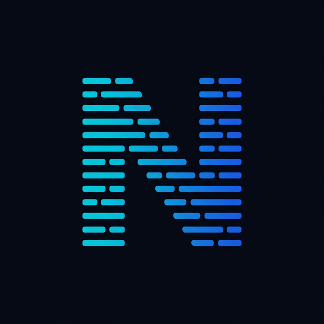

<p align="center">
  
</p>

# NanoLog 🚀

**轻量级、高性能的 Go 原生日志数据库 (The SQLite for Logs)**

[](https://hub.docker.com/r/cofferstech/nanolog)
[](https://goreportcard.com/report/github.com/coffersTech/nanolog)
[](https://opensource.org/licenses/MIT)

[English Documentation](./README_EN.md)

---

NanoLog 是一个专为云原生设计的轻量级日志存储引擎。它不像 Elasticsearch 那样沉重，也不像 Plain Text 那样难以检索。它定位为**日志界的 SQLite**：单二进制文件、极致性能、内置管理面板。

## ✨ 1.0.0 核心特性

- 🚀 **极速启动**：单二进制文件，0 运行时依赖，Docker 镜像仅约 20MB。
- 💾 **列式存储**：自研 `.nano` 格式，搭配 ZSTD 压缩，存储成本仅为原始 JSON 的 10%。
- 🔍 **混合查询**：内存 (MemTable) + 磁盘 (Columnar Storage) 混合检索，支持秒级逻辑查询。
- 🎨 **管理面板**：内嵌式 Vue 3 控制台，支持用户管理、API 密钥管理及系统配置。
- 🌐 **多语言支持**：原生支持中/英文切换，完美解决大屏展示与国际化需求。
- 🛡️ **安全加固 (Security at Rest)**：
    - **静态加密**：核心元数据 `.nanolog.sys` 采用 AES-GCM 算法强制加密。
    - **密码重置**：内置命令行工具，支持在忘记密码时快速重置管理员权限。
    - **RBAC 权限**：内置角色访问控制，SuperAdmin 专属管理权限。
    - **Bcrypt 散列**：用户密码采用 Bcrypt 强散列，杜绝明文存储。

## 🚀 快速开始

### 方案一：使用 Docker (推荐)

```bash
docker run -d \
  -p 8080:8080 \
  -v $(pwd)/data:/root/data \
  --name nanolog \
  cofferstech/nanolog:latest
```
> [!IMPORTANT]
> 默认情况下，`.nanolog.key` (密钥) 与 `.nanolog.sys` (加密数据) 都会保存在绑定的 `/root/data` 目录下。请务必妥善备份该目录。

### 方案二：源码运行 (使用快捷脚本)

```bash
git clone https://github.com/coffersTech/nanolog.git
cd nanolog/server
```

#### run.sh 命令一览

| 命令 | 说明 |
|------|------|
| `./run.sh standalone` | 启动全功能单机模式 ⭐ |
| `./run.sh console` | 启动为 Console 节点 (需配合 `--data-nodes`) |
| `./run.sh ingester` | 启动为 Ingester 存储节点 |
| `./run.sh reset-password` | 重置指定用户密码 (急救工具) |
| `./run.sh start` | 编译并启动 (支持自定义参数) |
| `./run.sh build` | 仅编译到 `bin/nanolog` |
| `./run.sh test` | 运行单元测试 |
| `./run.sh tidy` | 运行 go mod tidy |

#### 使用示例

```bash
# 单机模式 (开发测试推荐)
./run.sh standalone --port 8080

# Console 模式 (聚合查询多个 Ingester)
./run.sh console --port 8000 --data-nodes=http://localhost:8081,http://localhost:8082

# Ingester 模式 (日志存储节点)
./run.sh ingester --port 8081 --data ./data_1
```

## 🛠️ 初始化与登录

1. **系统初始化**: 启动后访问 `http://localhost:8080`，系统会提示进入初始化模式。
2. **创建管理员**: 设置第一个 `SuperAdmin` 账号。系统会加密保存并锁定。
3. **安全提示**: 如果密钥是自动生成的，控制台会打印醒目的 **WARNING**。请及时备份 `.nanolog.key`。

## ⚙️ 核心配置参数

| 参数 | 说明 | 默认值 |
| :--- | :--- | :--- |
| `--port` | 服务的监听端口 | `8080` |
| `--data` | 数据文件、密钥及元数据存储目录 | `./data` |
| `--web` | 静态网页资源目录 | `../web` |
| `--key` | 手动指定 Master Key 文件路径 | `<data>/.nanolog.key` |
| `--role` | 服务器角色 (`standalone`\|`console`\|`ingester`) | `standalone` |
| `--data-nodes` | 数据节点列表 (仅用于 console 角色) | (空) |
| `--admin-addr` | 管理节点地址 (用于 ingester 向 console 汇报) | `localhost:8080` |
| `--retention` | 数据保留时长 (例如 `168h`, `7d`) | `168h` |

## 🔌 接入指南 (API Auth)

从 v0.3.x 开始，任何向 `/api/ingest` 推送数据的请求都必须在 Header 中携带 API Key。

### HTTP 接入
**Header**: `Authorization: Bearer <YOUR_API_KEY>`

```bash
# 向 Ingester 节点推送日志
curl -X POST http://localhost:8081/api/ingest \
  -H "Authorization: Bearer sk-xxxxxx" \
  -d '{"level":"INFO", "msg":"Hello NanoLog"}'
```

### Java / Spring Boot 接入
1. **添加依赖**:
```xml
<dependency>
    <groupId>tech.coffers</groupId>
    <artifactId>nanolog-spring-boot-starter</artifactId>
    <version>0.1.1</version>
</dependency>
```
2. **配置配置项**:
```yaml
nanolog:
  server-url: http://localhost:8080
  api-key: sk-xxxxxxx
  service: order-api
```

### Python 接入
1. **安装 SDK**:
```bash
pip install nanolog-sdk
```

2. **配置 Logger**:
```python
from nanolog import NanoLogHandler
import logging

logger = logging.getLogger("my_app")
logger.addHandler(NanoLogHandler(
    server_url="http://localhost:8080",
    api_key="sk-xxxx",
    service="my-service"
))

logger.info("Hello from Python")
```

### Go 接入
1. **获取模块**:
```bash
go get github.com/coffersTech/nanolog/sdks/go/nanolog
```

2. **使用 slog**:
```go
import (
    "log/slog"
    "github.com/coffersTech/nanolog/sdks/go/nanolog"
)

handler := nanolog.NewHandler(nanolog.Options{
    ServerURL: "http://localhost:8080",
    APIKey:    "sk-xxxx",
    Service:   "go-service",
})
logger := slog.New(handler)

logger.Info("Hello from Go")
```

## 🌐 分布式部署 (Docker)

NanoLog 提供了强大的分布式扩展能力，支持真正的读写分离，单个 `console` 节点可管理数十个 `ingester` 存储节点。1.0.0 版本引入了 **高性能 Nginx 模板**，支持 Keepalive 长连接与集群域名自动注入。

### 快速启动

```bash
docker-compose -f docker-compose-distributed.yml up -d
```

### 架构说明

| 节点类型 | 默认端口 | 职责 | 核心组件 |
|------|------|------|-------------|
| **Console** | 8080 | Web UI、用户权限、API Key、**聚合查询** | MetaStore, Aggregator |
| **Ingester** | 8081 | 高速日志入库、WAL、**本地查询** | Engine (Storage) |

### 聚合查询配置

在启动 `console` 节点时，使用 `--data-nodes` 指定后端数据节点：

```bash
./nanolog --role=console --data-nodes="http://node-1:8080,http://node-2:8080"
```

### SDK 配置

将 SDK 的 `server-url` 直接指向任意一个 **Ingester** 节点以获得最高写入性能：

```yaml
nanolog:
  server-url: http://localhost:8081  # 指向 Ingester 端口
  api-key: sk-xxxxxxx
```

### 生产建议

#### 1. Docker Compose 一键部署

项目提供了完整的分布式部署配置：

```bash
docker-compose -f docker-compose-distributed.yml up -d
```

端口分配：
| 端口 | 服务 | 用途 |
|------|------|------|
| **8000** | Console | Web 管理界面 + 聚合查询 |
| **8088** | Nginx LB | SDK 统一写入入口 (轮询分发) |
| 8081/8082 | Ingester | 数据节点 (内部端口) |

#### 2. Nginx 反向代理配置

使用 Nginx 实现路由分流与负载均衡：

```nginx
upstream ingesters {
    server ingester-1:8080;
    server ingester-2:8080;
}

server {
    listen 80;
    
    # SDK 写入 → 轮询分发到 Ingester 集群
    location /api/ingest {
        proxy_pass http://ingesters;
    }
    
    # 管理 API → Console 节点
    location /api/system, /api/users, /api/tokens {
        proxy_pass http://console:8080;
    }
    
    # 聚合查询 → Console 节点
    location /api/search, /api/stats, /api/histogram {
        proxy_pass http://console:8080;
    }
    
    # Web UI → Console 节点
    location / {
        proxy_pass http://console:8080;
    }
}
```

#### 3. SDK 配置

```yaml
nanolog:
  server-url: http://your-nginx-lb:8088  # 指向 Nginx 负载均衡器
  api-key: sk-xxxxxxx
```

---

**NanoLog** - 让日志存储回归简单。  
如果你喜欢这个项目，请给一个 ⭐️ **Star**！
